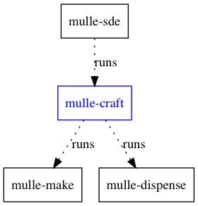
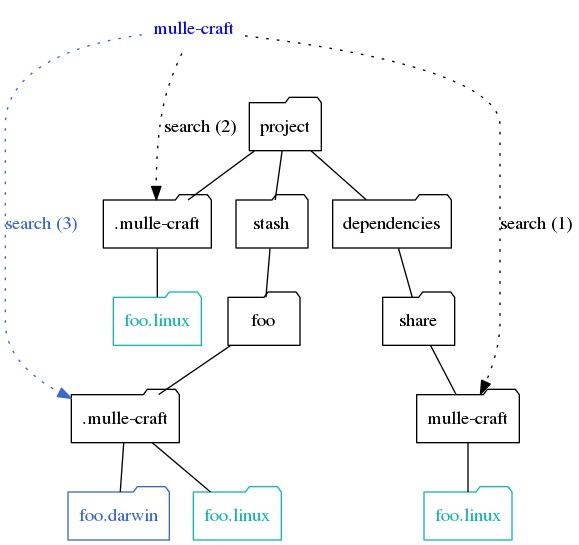

# mulle-craft, 🚬 Build projects with and without mulle sourcetrees


... for Linux, OS X, FreeBSD, Windows



**mulle-craft** builds two things:

* your *project* using [mulle-make](https://github.com/mulle-sde/mulle-make)
* the dependencies of your project as specified by a *buildorder* file. This
file can be generated by [mulle-sourcetree](https://github.com/mulle-sde/mulle-sourcetree).


Executable    | Description
--------------|--------------------------------
`mulle-craft` | Build projects and their dependencies


> **mulle-craft** is the successor to
> [mulle-build](https://github.com/mulle-nat/mulle-build).


## Install

See [mulle-sde-developer](//github.com/mulle-sde/mulle-sde-developer) how
to install mulle-sde.


## What mulle-craft does

Essentially, `mulle-craft` is a shortcut for typing:

```
# Build the dependencies
for i in `mulle-sourcetree buildorder`
do
   mulle-make install --prefix "${tmpdir}" "$i"
   mulle-dispense "${tmpdir}" "${DEPENDENCY_DIR}
done

# Build the project
mulle-make build "${PWD}"
```

So it's conceptually fairly simple, if you know how
[mulle-sourcetree](https://github.com/mulle-sde/mulle-sourcetree) and
[mulle-make](https://github.com/mulle-sde/mulle-make) and
[mulle-dispense](https://github.com/mulle-sde/mulle-dispense) work.

But then there are also variations and options :)


## The *info folder*

**mulle-make** accepts a so called *info-folder*, which contains compile
flags and environment variables to build a project.

These can be platform specific, but don't have to be. It is one of
**mulle-craft** tasks to pick the right *info-folder* and feed it to
**mulle-make**.


## How mulle-craft searches for the *info-folder*

First the `dependency/share/mulle-craft` folder will be searched
for matching folders. A match is made if the name of the to-be-built
project is the same as the *info-folder* name (without extension).

An *info-folder* may have an extension, which can be one of the simplified
**mulle-craft uname** outputs, which are platform specific.
An *info-folder* with a matching extension is preferred over a matching name
with no extension.

If mulle-craft finds no info-folder, **mulle-make** will use a project's own
`.mulle-make` folder, if present.




## GitHub and Mulle kybernetiK

The development is done on
[Mulle kybernetiK](https://www.mulle-kybernetik.com/software/git/mulle-craft/master).
Releases and bug-tracking are on
[GitHub](https://github.com/mulle-sde/mulle-craft).


