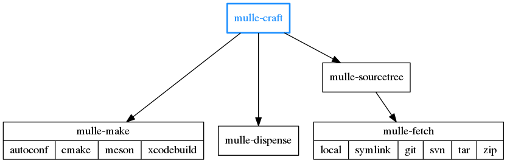

# mulle-craft, 🚬 Build projects with and without mulle sourcetrees


... for Linux, OS X, FreeBSD, Windows



**mulle-craft** builds your project and it's dependencies. The dependencies are specified using [mulle-sourcetree](https://github.com/mulle-sde/mulle-sourcetree). 


Executable    | Description
--------------|--------------------------------
`mulle-craft` | Build projects and their dependencies


> **mulle-craft** is the successor to [mulle-build](https://github.com/mulle-nat/mulle-build).


## Install

OS    | Command
------|------------------------------------
macos | `brew install mulle-kybernetik/software/mulle-craft`
other | ./install.sh  (Requires: [mulle-sourcetree](https://github.com/mulle-sde/mulle-sourcetree),[mulle-make](https://github.com/mulle-sde/mulle-make),[mulle-dispense](https://github.com/mulle-sde/mulle-dispense))


## What mulle-craft does

Essentially, `mulle-craft` is a shortcut for typing:

```
# Build the dependencies
for i in `mulle-sourcetree buildorder`
do
   mulle-make install --prefix "${tmpdir}" "$i"
   mulle-dispense "${tmpdir}" "${DEPENDENCIES_DIR}
done

# Build the project
mulle-make build "${PWD}"
```

So it's conceptually fairly simple, if you know how [mulle-sourcetree](https://github.com/mulle-sde/mulle-sourcetree) and [mulle-make](https://github.com/mulle-sde/mulle-make) and [mulle-dispense](https://github.com/mulle-sde/mulle-dispense) work. 

But then there are also variations and options :) 


## How mulle-craft searches for the `mulle-make --info-dir`

Firs the `dependencies/share/mulle-craft/mulle-make` folder will be searched for any matches.

Non matching "uname" extensions are ignored. Matching extensions are preferred though.

Then the projects own `.mulle-make` folders will be considered.

Assume that you are on **darwin** in the following picture, the `.linux` folder will be ignored:


## GitHub and Mulle kybernetiK

The development is done on [Mulle kybernetiK](https://www.mulle-kybernetik.com/software/git/mulle-craft/master). Releases and bug-tracking are on [GitHub](https://github.com/mulle-sde/mulle-craft).


