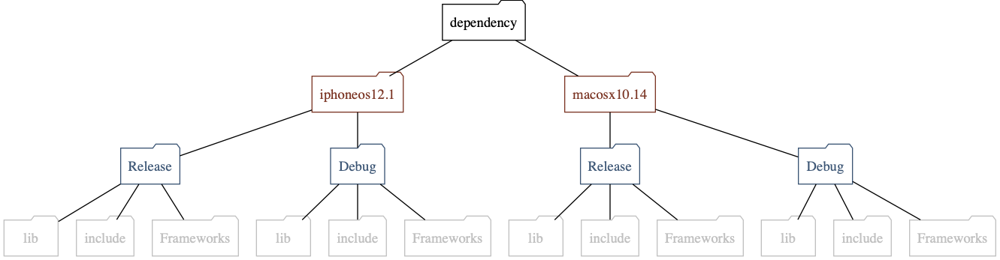
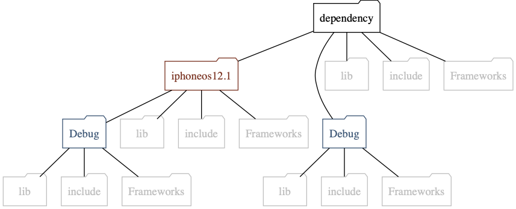

# mulle-craft

🚬 Build projects with and without sourcetrees


... for Linux, OS X, FreeBSD, Windows


**mulle-craft** builds two things:

* your *project* using [mulle-make](https://github.com/mulle-sde/mulle-make)
* the dependencies of your project as specified by a *craftorder* file. This
file can be generated by [mulle-sourcetree](https://github.com/mulle-sde/mulle-sourcetree).

*mulle-craft* is unaware of the build tool to use (e.g. *cmake* or *xcodebuild*).
That is determined by *mulle-make*, which gets called from *mulle-craft*.


Executable    | Description
--------------|--------------------------------
`mulle-craft` | Build projects and their dependencies


> **mulle-craft** is the successor to
> [mulle-build](https://github.com/mulle-nat/mulle-build).


## What mulle-craft does

Essentially, `mulle-craft` is a shortcut for typing:

```
# Build the dependencies
for project in `mulle-sourcetree craftorder`
do
   for sdk in ${MULLE_CRAFT_SDKS}
   do
      for platform in ${MULLE_CRAFT_PLATFORMS}
      do
         for configuration in ${MULLE_CRAFT_CONFIGURATIONS}
         do
            mulle-make install --sdk "${sdk}" \
                               --platform "${platform}" \
                               --configuration "${configuration}" \
                               --definition-dir ".mulle/share/craft/definition" \
                               --definition-dir "dependency/${sdk}-${platform}/share/mulle-craft/${project}/definition" \
                               --prefix "${tmpdir}" \
                               "${project}"
            mulle-dispense "${tmpdir}" "dependency/${sdk}-${platform}/${configuration}"
         done
      done
   done
done

# Build the project
mulle-make craft "${PWD}"
```


So it's conceptually fairly simple, if you know how
[mulle-sourcetree](https://github.com/mulle-sde/mulle-sourcetree) and
[mulle-make](https://github.com/mulle-sde/mulle-make) and
[mulle-dispense](https://github.com/mulle-sde/mulle-dispense) work.

But then there are also variations and options :)


### The craftinfo and the definition folder

**mulle-make** accepts a so called *definition-folder*, which contains compile
flags and environment variables "definitions" to craft a project.
These definitions can be supplemented and overridden by an auxiliary definition
folder.

In a typical mulle-sde project the main definition-folder is located in the
`.main/<share|etc>/craft` folder. The auxiliary definition folder is
found inside `dependency/share/mulle-craft/${projectname}`.
This location is called the "craftinfo" as it can also contain other craft
related information besides the definitions..

These definitions can be platform specific. A folder suffix
distinguishes between the definitions for the various platforms. It is one of
**mulle-craft** tasks to pick the right *definition-folders* and feed them to
**mulle-make**.


#### How mulle-craft searches for the craftinfo

First the `dependency/share/mulle-craft` folder will be searched
for matching folders. A match is made if the name of the to-be-built
project is the same as the *craftinfo* name (without extension).

Inside the *craftinfo* folder there are the "definitions". A *definition-folder*
may have an extension (one of the platform specific.`mulle-craft uname`
outputs. A *definition-folder* with a matching extension is preferred over a
matching name with no extension.

If mulle-craft finds no info-folder there then a project specific
`.mulle/etc/craft` or `.mulle/share/craft` folder is searched if present.


### Dispense styles

*mulle-craft* builds dependencies in various configuration such as
unoptimized (Debug) or optimized (Release). It can also craft for multiple
SDKs and platforms. If only a single depedency folder destination were to be
used the outputs of the various configurations would clobber each other.
That's where the *dispense style* comes into play.

The easiest to understand is the *strict* style.



> In this picture for simplicity it is assumed that there is only one
> platform. Otherwise the "sdk" folders would be multiplied by the number
> of platforms to craft for (with the platform name appended)

The `auto` style is the default and it is somewhat more convenient in actual
usage:



Here the contents of the "Release" folders are moved upwards and the "Release"
folder itself is deleted.


## Install

See [mulle-sde-developer](//github.com/mulle-sde/mulle-sde-developer) how
to install mulle-sde.


## GitHub and Mulle kybernetiK

The development is done on
[Mulle kybernetiK](https://www.mulle-kybernetik.com/software/git/mulle-craft/master).
Releases and bug-tracking are on
[GitHub](https://github.com/mulle-sde/mulle-craft).


